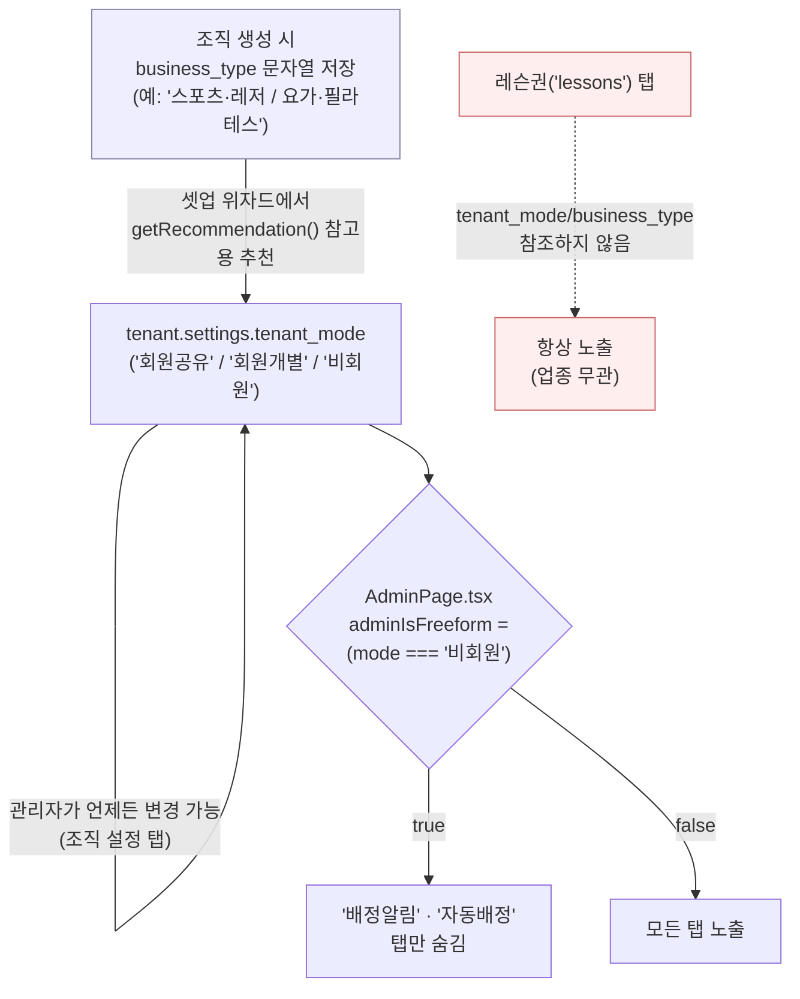

# 업종별 기능 매핑 분석 (2026-07-29)

## 0. 배경 / 요청 사항

> "레슨권을 만들었는데, 모든 업종이 레슨권을 쓸 것 같지 않다. 업종별로 관련 기능을 매핑하고,
> 이걸 시스템관리자가 컨트롤할 수 있는지 확인하고 싶다."

이 문서는 **코드/DB를 직접 조사한 결과**를 바탕으로 (1) 현재 "업종"이라는 개념이 시스템에 어떻게
존재하는지, (2) 기능이 업종/조직별로 실제로 어떻게 켜지고 꺼지는지, (3) 시스템관리자가 이를
컨트롤할 수 있는 지점이 있는지를 정리한다. 코드 변경은 포함하지 않은 **분석 전용 문서**다.

---

## 1. 조사한 코드 위치

| 영역 | 파일 |
|---|---|
| 업종 데이터 | `src/data/industryCategories.ts` (대분류 8종 + 기타, 세부업종 다수) |
| 업종 입력 UI | `src/components/IndustryPicker.tsx`, `src/components/setup/steps/Step1OrgName.tsx` |
| 업종 저장 컬럼 | `supabase/reset_db.sql` → `tenants.business_type text` |
| 업종 → 운영모드 추천 | `src/lib/wizardModeRecommendation.ts` (`getRecommendation()`) |
| 운영모드(tenant_mode) 정의 | `src/types/index.ts` → `TenantMode = '회원공유' \| '회원개별' \| '비회원'` |
| 유일한 자동 기능 숨김 로직 | `src/pages/AdminPage.tsx` (`adminIsFreeform`, `TAB_LABELS`) |
| 레슨권 기능 | `supabase/migrations/075_lesson_packages.sql`, `src/pages/AdminPage.tsx` (`lessons` 탭) |
| 요금제(Plan) 제한 | `src/contexts/PlanLimitsContext.tsx`, `plan_limits` 테이블 (max_orgs/max_users만 존재) |
| 슈퍼관리자 조직 관리 화면 | `src/components/superadmin/OrgDrawer.tsx`, `HubMain.tsx`, `OrgTreeView.tsx`, `OrgCardsView.tsx` |

---

## 2. 핵심 발견

1. **업종(`business_type`)은 저장만 될 뿐, 어떤 기능도 이 값을 직접 참조하지 않는다.**
   `tenants.business_type`은 조직 생성 시 문자열로 저장되고 슈퍼관리자 화면에 표시되지만,
   레슨권·자동배정·역할관리 등 어떤 기능 코드에서도 `business_type`을 조건으로 쓰는 곳이 없다
   (전체 코드베이스 검색 결과 `business_type` 기반 분기 0건).

2. **유일하게 존재하는 자동 "기능 숨김" 로직은 업종이 아니라 `tenant_mode` 기준이다.**
   `AdminPage.tsx`:
   ```ts
   const adminTenantMode = displayMode(adminTenant?.settings?.tenant_mode)
   const adminIsFreeform = adminTenantMode === '비회원'
   // ...
   {(Object.keys(TAB_LABELS) as Tab[]).filter(t =>
     !(adminIsFreeform && (t === 'notifications' || t === 'autoassign'))
   )}
   ```
   `tenant_mode`가 `'비회원'`(예: 식당·카페·병원처럼 그때그때 예약자를 입력하는 방식)이면
   "배정알림"·"자동배정" 탭 **2개만** 숨겨진다. 나머지 탭(레슨권 포함)은 전부 노출된다.

3. **`tenant_mode`는 업종에서 "추천"될 뿐, 강제되지 않는다.**
   `wizardModeRecommendation.ts`가 세부업종(예: "스포츠·레저/요가·필라테스" → `회원개별`)을
   기준으로 추천값을 제시하지만, 이는 셋업 위자드 단계에서 **참고용 제안**일 뿐이고
   관리자가 "조직 설정" 탭에서 언제든 자유롭게 다른 모드로 바꿀 수 있다. 즉 업종과 실제
   `tenant_mode` 값이 어긋날 수 있다.

4. **레슨권 기능은 업종/모드와 무관하게 모든 조직에 항상 노출된다.**
   `lessons` 탭은 `TAB_LABELS`에 고정 등록되어 있고 `adminIsFreeform` 필터 대상도 아니다.
   식당이든 행정기관이든 관리자콘솔에 들어가면 "레슨권" 탭이 그대로 보인다.

5. **요금제(Basic/Pro/Business)도 기능 on/off와 무관하다.**
   `plan_limits` 테이블 컬럼은 `max_orgs`, `max_users` 두 개뿐이다. 특정 기능을 특정 플랜에서만
   쓰게 하는 구조 자체가 없다.

6. **결론 — 시스템관리자가 업종별로 기능을 켜고 끌 수 있는가? → 불가능 (현재 미구현).**
   - DB에 feature-flag 성격의 컬럼/테이블이 전혀 없다 (`tenants`, `tenant_roles`, `plan_limits`
     어디에도 "이 조직은 레슨권을 쓴다/안 쓴다" 같은 값이 없음).
   - 슈퍼관리자 화면(`SuperAdminPage.tsx`, `OrgDrawer.tsx` 등)에는 조직별 기능 토글 UI가 없다.
   - 존재하는 유일한 자동 숨김(`adminIsFreeform`)도 (a) 업종이 아니라 모드 기준이고,
     (b) 시스템관리자가 아니라 조직 설정값에 종속되며, (c) 레슨권을 포함하지 않는다.

---

## 3. 업종별 "레슨권" 적합도 (대분류 기준)

레슨권(`lesson_package_types` + `lesson_packages`)은 **횟수제 이용권**(예: "10회권, 60일 유효")
모델이다. 세션 단위로 요금을 미리 받고 소진하는 업종에는 맞지만, 근무 스케줄형·워크인 예약형
업종에는 개념 자체가 맞지 않는다.

| 대분류 업종 | 대표 세부업종 | 레슨권 적합도 | 근거 |
|---|---|:---:|---|
| 뷰티·헬스 | 헬스클럽·피트니스(PT) | 🟢 높음 | PT 횟수권이 표준 판매 단위 |
| 뷰티·헬스 | 미용실·네일·스파 | 🔴 낮음 | 대부분 방문당 결제, 회차권 드묾 |
| 의료·보건 | 요양원·요양병원 | 🟡 중간 | 이용권보다는 입소 계약 단위 |
| 의료·보건 | 병원·의원·치과·한의원·약국 | 🔴 낮음 | 진료는 건당 청구, 회차권 개념 없음 |
| 교육 | 학원·교습소, 강사·튜터 | 🟢 높음 | 수강권(N회 수업권)이 표준 |
| 교육 | 어린이집·유치원·학교 | 🔴 낮음 | 월 단위 등록, 회차 소진 개념 없음 |
| 스포츠·레저 | 요가·필라테스, 골프, 무술 | 🟢 높음 | 회원권/레슨권이 업계 표준 판매 단위 |
| 스포츠·레저 | 수영장, 종합스포츠센터 | 🟡 중간 | 강습은 회차권, 시설이용은 기간권인 경우도 많음 |
| 음식·외식 | 식당·카페·베이커리 | 🔴 낮음 | 예약/근무 스케줄, 이용권 개념 없음 |
| 소매·유통 | 편의점·마트 | 🔴 낮음 | 순수 근무 스케줄 |
| 전문·사무서비스 | 법무·IT·디자인·부동산 | 🔴 낮음 | 순수 근무 스케줄 |
| 공공·비영리 | 행정기관·도서관·복지·종교·봉사 | 🔴 낮음 | 순수 근무/봉사 스케줄 |

🟢 표준적으로 필요 · 🟡 업체 운영 방식에 따라 다름 · 🔴 거의 불필요

**시사점:** 12개 세부업종 그룹 중 레슨권이 표준적으로 쓰이는 곳은 **4곳 내외**(PT, 학원/튜터,
요가·필라테스류, 골프·무술)뿐이다. 나머지 업종 관리자에게는 항상 노출되는 "레슨권" 탭이
불필요한 UI 노이즈가 될 수 있다는 사용자의 문제의식이 코드 조사 결과와 일치한다.

---

## 4. 전체 기능 × 운영모드(tenant_mode) 관련성 매트릭스

업종별 데이터가 DB에 없으므로, 현재 구조에서 업종과 가장 가까운 대리 지표인 **`tenant_mode`**
(회원공유/회원개별/비회원) 기준으로 각 기능의 필요성을 정리했다. `getRecommendation()`이 업종을
이 값에 매핑하므로, 아래 표는 사실상 "업종 그룹별 기능 필요성"으로 읽어도 무방하다.

| 기능 (AdminPage 탭 기준) | 회원공유<br>(직원 공동스케줄: 소매·사무·행정 등) | 회원개별<br>(강사가 회원별 관리: 학원·PT·요가 등) | 비회원<br>(워크인 예약: 식당·병원·미용실 등) | 현재 상태 |
|---|:---:|:---:|:---:|---|
| 회원 관리 | ✅ | ✅ | ⚠️ (예약자=1회성) | 항상 노출 |
| 승인 대기 | ✅ | ✅ | ⚠️ 필요성 낮음 | 항상 노출 |
| 역할 관리 | ✅ | ✅ | ⚠️ 필요성 낮음 | 항상 노출 |
| 스케줄 규칙 | ✅ | ✅ | ✅ | 항상 노출 |
| 날짜 설정(휴관일 등) | ✅ | ✅ | ✅ | 항상 노출 |
| 조직 설정 | ✅ | ✅ | ✅ | 항상 노출 |
| **자동배정** | ✅ | ✅ | ❌ 개념 없음 | **자동 숨김 (구현됨)** |
| 범례 관리 | ✅ | ✅ | ⚠️ | 항상 노출 |
| 입력항목(커스텀필드) | ✅ | ✅ | ✅ | 항상 노출 |
| **D-1 배정알림** | ✅ | ✅ | ❌ 개념 없음 | **자동 숨김 (구현됨)** |
| **레슨권** | ❌ 개념 없음 | ✅ (업종에 따라) | ❌ 개념 없음 | **항상 노출 (미구현 — 문제 지점)** |
| 피드백 | ✅ | ✅ | ✅ | 항상 노출 (업종 무관 공통 기능) |

✅ 필요 · ⚠️ 업체별 편차 큼 · ❌ 대부분 불필요

**읽는 법:** "자동배정"·"D-1 배정알림"은 이미 `tenant_mode` 기준으로 자동 숨김 처리가 되어 있는데,
동일한 논리라면 **레슨권도 `회원공유`/`비회원` 모드에서는 숨겨져야 앞뒤가 맞는다.** 하지만
현재 레슨권만 이 로직에서 빠져 있다.

---

## 5. 현재 아키텍처 (기능 노출 결정 흐름)



**시스템관리자(슈퍼관리자)는 이 흐름 어디에도 개입 지점이 없다.** 슈퍼관리자 화면은 조직의
이름·업종 문자열·플랜·활성화 여부만 다루고, 개별 기능 on/off는 다루지 않는다.

---

## 6. 시스템관리자 컨트롤 가능 여부 — 결론

| 질문 | 답변 |
|---|---|
| 업종별로 기능을 다르게 노출하는 로직이 있는가? | **없음** (모드 기반 2개 탭 제외) |
| 시스템관리자가 조직별/업종별 기능을 켜고 끌 수 있는 UI가 있는가? | **없음** |
| DB에 그런 설정을 저장할 자리가 있는가? | **없음** (`tenants.settings` jsonb는 있지만 기능 플래그 키가 정의돼 있지 않음) |
| 레슨권이 업종에 안 맞아도 관리자가 스스로 숨길 방법이 있는가? | **없음** (탭 자체를 끌 수 없음) |

**정리: 현재는 시스템관리자든 조직관리자든 업종/기능 매핑을 컨트롤할 수단이 전혀 없다.**
모든 조직에 모든 기능(레슨권 포함)이 항상 노출된다.

---

## 7. 참고 — 향후 구현한다면 고려할 방향 (구현 아님, 방향 제시만)

실제 구현은 이 문서 범위 밖이며, 방향을 고를 때 참고할 수 있도록 옵션만 정리한다.

1. **`tenant.settings`에 기능 플래그 추가 + 슈퍼관리자 UI 토글**
   `settings.feature_flags = { lesson_packages: true, autoassign: true, ... }` 형태로 저장하고,
   `OrgDrawer.tsx`(슈퍼관리자 조직 상세)에 체크박스 UI 추가. `AdminPage.tsx`의 `TAB_LABELS` 필터에
   `adminIsFreeform`과 동일한 방식으로 조건 추가.
   - 장점: 조직 단위로 세밀하게 제어, 기존 `adminIsFreeform` 패턴 재사용 가능.
   - 단점: 조직이 많아지면 슈퍼관리자가 매 조직 수동 설정해야 함.

2. **`business_type` 기반 기본값 자동 산출 + 조직관리자가 개별 오버라이드**
   업종 → 기본 활성 기능 세트를 코드에 매핑(본 문서 3~4장 매트릭스를 그대로 룰로 사용)해 신규
   조직 생성 시 자동 세팅하고, 그 위에 (1)의 수동 토글로 예외를 허용.
   - 장점: 대부분 조직은 손댈 필요 없이 알맞게 설정됨.
   - 단점: 매핑 규칙을 다이나믹 구현 원칙(하드코딩 금지 규칙)에 맞게 설정 테이블로 관리해야 함.

3. **레슨권만 우선 최소 대응**
   전체 feature-flag 체계 대신, 레슨권 탭 하나만 `tenant.settings.enable_lesson_packages`
   불리언으로 추가해 조직관리자가 "조직 설정" 탭에서 직접 켜고 끄게 하는 최소 범위 대응.
   - 장점: 가장 빠르고 리스크 작음.
   - 단점: 향후 다른 기능도 업종별로 걸러야 할 경우 매번 개별 필드를 추가해야 함(확장성 낮음).

이 중 어느 방향으로 진행할지는 별도로 결정이 필요하다.
